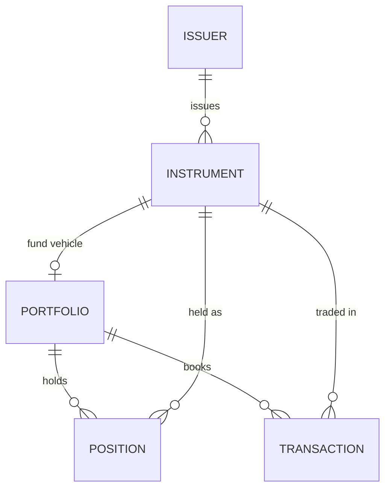

# Quadra Core Data Model

The operational core of the [Quadra](https://quadraplatform.com) investment data model — a
clean, **deployable** relational schema for the five entities every investment book turns on:
**portfolios, issuers, instruments, transactions, and positions**, with their supporting
reference data.

Real, load-it-into-Postgres SQL — FIBO-informed and built from a production model.

## What's here

| File | |
|------|--|
| `quadra-core.postgres.sql` | PostgreSQL DDL — 14 tables across `core` and `ref` schemas |
| `schema/quadra-core.aml` | Source model in [AML](https://azimutt.app/aml) (Alternative Modeling Language) |
| `schema/quadra-core.dbml` | [DBML](https://dbml.dbdiagram.io) — paste into [dbdiagram.io](https://dbdiagram.io) for an interactive ERD |

## Entities

**Core (5)** — `portfolio` · `issuer` · `instrument` · `transaction` · `position`

**Reference (9)** — `currency` · `country` · `exchange` · `instrument_type` ·
`portfolio_type` · `investment_strategy` · `transaction_type` · `position_type` · `source`



Reference tables provide the lookups (currencies, countries, exchanges, and the type/source
enumerations) that the core entities key against. Multi-currency throughout — positions and
transactions carry both base and local amounts.

## Use it

```bash
# Load into a PostgreSQL database
psql -d your_db -f quadra-core.postgres.sql
```

Creates the `core` and `ref` schemas, 14 tables, and their foreign keys. This is a **schema
showcase** — structure and design, not a runnable application or seeded dataset.

## Beyond this slice

The full Quadra data model extends this core with parties & custody accounts (transactions link
to counterparties, brokers, custodians, and settlement accounts), master data management,
valuations & performance, benchmarks, corporate actions, and private-markets, real-estate, and
infrastructure packs — 180+ tables in total. This repository is the public, self-contained core.

## Maintenance

Generated from the full Quadra data model — **do not edit by hand**. Changes flow from the
upstream source, keeping this slice always in step with the production schema.

## License

**TBD** — a permissive open-source license (MIT or Apache-2.0) will be finalized before this
repository is made public.
