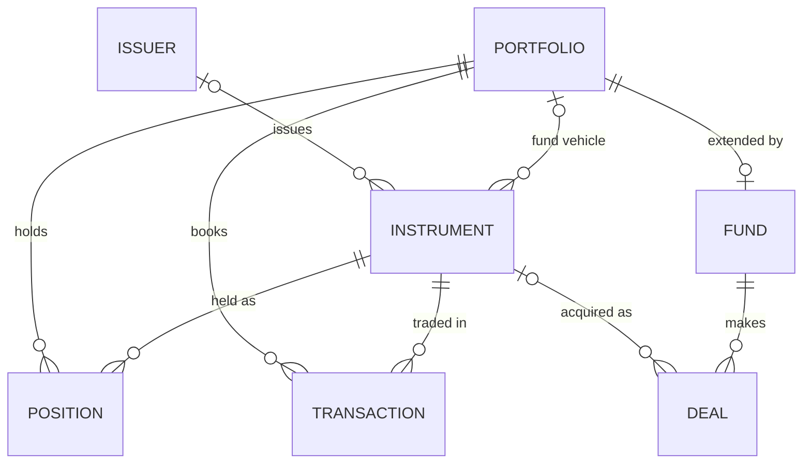

<p align="center">
  <a href="https://quadraplatform.com">
    <picture>
      <source media="(prefers-color-scheme: dark)" srcset="assets/quadra-wordmark-white.svg">
      
    </picture>
  </a>
</p>

# Quadra Data Model Sample

> **This repository contains a sample of the [Quadra](https://quadraplatform.com)
> investment data model: 20 tables out of more than 180 across the full model's 18
> domains.** It is published for evaluation and represents roughly 10% of the model.
> It is not intended to run an investment book on its own.
>
> **The full Quadra Data Model and Quadra Platform are licensed under the Business
> Source License 1.1, with production use available at zero licence cost for qualified
> buy-side institutions.** See [Access and licensing](#access-and-licensing).

**Quadra is an AI-native investment data management platform** for asset managers,
asset owners, wealth managers, family offices, and insurers. It brings together data
from investment systems, custodians, fund administrators, data providers, and documents,
then resolves and masters entities into a trusted investment book with cell-level lineage.
The resulting data is ready for operations, reporting, analytics, applications, and AI agents.

The model spans public and private markets. It gives structured feeds and messy documents
such as capital call notices and prospectuses a shared, documented destination.

## What's included

The sample covers the core that every investment book turns on: portfolios, issuers,
instruments, transactions, and positions. It adds part of the private-markets model,
including funds and deals, together with the reference data they use.

The full model extends much further, covering parties and custody, pricing and valuations,
performance and attribution, benchmarks, corporate actions, cash flows, classifications,
fund operations, private markets, infrastructure, real estate, metadata, lineage, and
master data management.

The schema is real and deployable. Load it into PostgreSQL and it builds. It is informed by
FIBO, the Financial Industry Business Ontology, and generated from the same model source as
the full platform.

This repository is a **read-only publication** generated from the model maintained upstream.
Updates arrive when the included tables change, usually quarterly to semi-annually. Issues
and pull requests are not accepted.

| File | Description |
|---|---|
| `quadra-sample.postgres.sql` | PostgreSQL DDL, ready to load |
| `schema/quadra-sample.aml` | Source model in [AML](https://azimutt.app/aml) (Alternative Modeling Language) |
| `schema/quadra-sample.dbml` | [DBML](https://dbml.dbdiagram.io), ready to paste into [dbdiagram.io](https://dbdiagram.io) for an interactive entity relationship diagram |

## Entities

<!-- generated:entities start -->
**20 tables** across the `core`, `fund`, `pm`, `ref`, and `mdm` schemas.

**Core (5):** `portfolio` · `issuer` · `instrument` · `transaction` · `position`

**Fund (2):** `fund` · `fund_type`

**Private markets (3):** `deal` · `deal_type` · `deal_stage`

**Reference (9):** `currency` · `country` · `exchange` · `instrument_type` · `portfolio_type` · `investment_strategy` · `transaction_type` · `position_type` · `source`

**Master data (1):** `master_key`


<!-- generated:entities end -->

The diagram shows how the core entities relate. For the complete sample picture, including
every reference lookup, paste `schema/quadra-sample.dbml` into
[dbdiagram.io](https://dbdiagram.io).

Reference tables provide currencies, countries, exchanges, and type and source enumerations.
Positions and transactions carry base and local amounts. A fund is also a portfolio for
position and valuation tracking, and it makes deals through the private-markets model.
`master_key` is the identity registry used by mastered entities.

## Try it

```bash
# Load into a PostgreSQL database
psql -d your_db -f quadra-sample.postgres.sql
```

This creates the schemas, the tables listed above, and their foreign keys. The repository
contains schema structure and design rather than an application or seeded dataset.

## What Quadra does

Investment firms depend on data from order and portfolio management systems, custodians,
fund administrators, market data vendors, risk systems, internal applications, and documents.
Each source describes investments differently. Identifiers conflict, values arrive at
different times, and teams repeatedly reconcile the same information for different uses.

Quadra gives that data one documented destination. Its data model, ingestion and distribution
services, entity resolution, mastering, quality controls, cell-level lineage, and operational
layer work together to create a governed investment book.

### One model across public and private markets

The full Quadra Data Model spans more than 180 tables across 18 domains, including:

- instruments, issuers, parties, and their relationships
- portfolios, positions, transactions, and cash flows
- pricing, valuations, corporate actions, and benchmarks
- classifications, performance, and attribution
- funds, investors, commitments, capital calls, and distributions
- private-market deals, portfolio companies, ownership, and financing
- infrastructure and real estate
- reference data, metadata, lineage, and master data management

The model is informed by FIBO and supports multiple currencies, effective dating, point-in-time
queries, and extensions that live alongside the core tables. Every table and column carries a
description, giving people, applications, and AI agents a machine-readable investment ontology.

### Entity resolution and master data management

Quadra provides a generic entity resolution and master data management framework that can be
applied to any entity in the model.

The **instrument master**, also commonly called a security master, consolidates instruments
from multiple providers and internal systems. The **issuer master** resolves the organisations
that issue them. The same framework supports parties, investment products, portfolios, and
other domains without requiring a separate mastering engine for each one.

Matching identifies records that describe the same entity. Configurable survivorship rules
select the preferred value for each field. Conflicts, source priority, and the reason for each
selection remain visible.

### Cell-level lineage

Quadra traces each mastered value back to its source, transformation, and survivorship decision.
This is cell-level lineage, which is more precise than assigning one source to a row or recording
only which process handled a dataset.

A single instrument record might use an identifier from one provider, a classification from
another, and a preferred name selected from an internal source. Quadra preserves the evidence
for every value. Users and AI agents can see where an answer came from and why that value was
selected.

### Structured feeds and investment documents

Important investment data often arrives in inconsistent files and documents. This is especially
common in private markets, where capital call notices, distribution notices, prospectuses, side
letters, valuation reports, and fund documents may arrive as PDFs through email or manager portals.

Quadra extracts structured facts from these documents and links them to the funds, investors,
commitments, instruments, issuers, deals, cash flows, and other entities they describe. The
original document remains connected as evidence. Extracted fields retain confidence, page
references, review status, and lineage through to the conformed Quadra record.

A capital call can become a governed capital notice linked to the relevant fund, investor
commitment, cash flow, and deal funding. Terms extracted from a prospectus can be associated
with the relevant instrument, issuer, fund, or investment product inside the same model used
for positions, transactions, valuations, and reporting.

Adaptive ingestion templates capture source instructions, extraction fields, mappings,
transformations, quality rules, entity links, and review requirements. They accommodate
variation between sources while producing consistent data in the Quadra model.

### AI-native operations

Quadra is designed for a world where agents and people are both users of the investment data
platform. The model, metadata, permissions, operational context, and cell-level lineage give
agents the investment meaning and applied organisational knowledge required to perform useful,
grounded work.

Agentic pipeline builders interpret incoming datasets and documents, propose mappings and
transformations, generate governed ingestion workflows, and accelerate the onboarding of new
sources. For PDFs, agents can identify the document type, extract relevant fields, propose
links to existing entities, and retain page-level evidence for review.

Agents can also assist with entity resolution, anomaly detection, data quality investigation,
workflow operation, and natural-language analysis. They work from the same permissions,
controls, and evidence available to human operators.

The same metadata supports **self-healing data pipelines**. When a source schema or document
format changes, an agent can diagnose the difference, propose an update to the ingestion
template, test the revised pipeline, and apply its review process before the change reaches
production.

## Where Quadra fits

Quadra sits alongside existing systems as the data management layer they feed and the layer
that reporting, analytics, applications, and AI agents read from.

| Existing system or provider | What flows into Quadra |
|---|---|
| **Order, execution, and portfolio management systems** such as BlackRock Aladdin, Charles River, SimCorp, Bloomberg AIM, and Enfusion | Orders, executions, positions, and portfolio structures |
| **Custodians** such as State Street, Northern Trust, BNY, J.P. Morgan, Citi, and HSBC | Settled positions, transactions, cash, and corporate actions |
| **Fund administrators** | Valuations, capital activity, fund accounting, and registry data |
| **Market and reference data providers** such as Bloomberg, LSEG, FactSet, MSCI, S&P, and Morningstar | Instrument terms, identifiers, prices, curves, and classifications |
| **Risk and performance systems** | Exposures, factor loadings, returns, and attribution |
| **Private-markets managers, administrators, and data providers** | Funds, deals, commitments, capital calls, distributions, cash flows, and documents |

Trading remains in the order management system and safekeeping remains with the custodian.
Quadra connects their data with administration, market data, risk, private markets, and internal
sources. The resulting investment book can complement an existing enterprise data management
platform or take over selected data management functions over time.

## Cloud and lakehouse choice

Quadra is **cloud-agnostic and lakehouse-agnostic**. PostgreSQL provides the operational data
store. DuckLake is the default lakehouse, with Apache Iceberg and Delta Lake also supported.
The platform runs across Azure, AWS, and Google Cloud and supports Snowflake, Databricks, and
Microsoft Fabric.

This choice allows clients to use their existing cloud and analytical platform. Quadra's
containerised services and smaller default technology footprint also allow the platform and
managed operation to run at a fraction of the cost of traditional enterprise data management
deployments.

## Managed service and implementation

Quadra's preferred delivery model is a fully managed investment data service. We host and run
the platform, cloud infrastructure, data pipelines, monitoring, backups, updates, and daily data
operation. Clients receive the governed investment book while Quadra operates the technology
and processes behind it.

Where policy or data residency requirements call for it, Quadra can operate the service inside
the client's cloud account and chosen region. Professional services and self-managed or shared
responsibility arrangements are also available.

- **Fully managed service.** Quadra hosts and operates the investment data platform and its
  data processes.
- **Professional services.** The team assesses the existing data estate, designs the target
  architecture, deploys the platform, builds integrations, configures mastering, and validates
  the resulting data.
- **Self-managed or shared responsibility.** Clients can operate the platform in their own
  infrastructure or divide operational responsibility with Quadra.

## Experience and trust

Selecting an investment data platform is also a decision about the people who will implement
and operate it. Quadra was founded in 2026 by a team whose experience spans earlier successful
investment data businesses.

The team behind Quadra helped build Cadis, the enterprise data management company acquired by
Markit in 2012 and renamed Markit EDM. The team also includes the founders of Matrix Investment
Data Management, acquired by Rimes in 2021.

Across those businesses, the team earned a strong industry reputation and completed every
implementation successfully. That experience covers product design, implementation, managed
data services, and the operational realities of institutional investment data. Quadra clients
work directly with the people who designed the model, built the platform, and have solved these
problems before.

## Common questions

### What is Quadra?

Quadra is an AI-native investment data management platform. It brings structured feeds and
investment documents into a shared model, resolves and masters entities, preserves cell-level
lineage, and makes governed data available to people, applications, and agents.

### Is Quadra an investment book of record?

Quadra provides the model and processing required for an investment book of record, including
positions, transactions, valuations, corporate actions, effective dating, and point-in-time
history. It can serve as a mastered data layer beside existing books or as the primary investment
data record for downstream use.

### Does Quadra include a security master?

Yes. Quadra calls it an instrument master because the model covers securities and other
investment instruments. The same entity resolution and mastering framework supports issuers,
parties, investment products, portfolios, and other investment domains.

### Can Quadra ingest private-markets PDFs?

Yes. Quadra extracts structured data from capital call notices, prospectuses, and other
documents. It links the document and extracted values to the funds, commitments, instruments,
issuers, deals, cash flows, and other entities they describe while preserving page-level
evidence and cell-level lineage.

### Does Quadra replace an order or portfolio management system?

Quadra usually sits alongside these systems. Trading and portfolio workflows stay where they
are, while Quadra combines their outputs with custody, administration, market data, risk, and
private-markets sources. Clients can simplify overlapping data processes over time.

### Can Quadra host and operate the platform?

Yes. A fully managed investment data service is Quadra's preferred model. Quadra can host the
service or operate it within the client's cloud account and region. Professional services,
self-managed deployment, and shared-responsibility arrangements are also available.

### Is Quadra open source?

The full Quadra Data Model and Quadra Platform are licensed under the Business Source License
1.1. Customers receive source access, and each release converts to Apache License 2.0 after ten
years. This public sample is separately available under the MIT licence for evaluation.

### How mature is Quadra?

Quadra was founded in 2026 by people who helped build Cadis, which became Markit EDM, and
Matrix IDM, which was acquired by Rimes. Across those earlier businesses, the team completed
every implementation successfully and earned a strong reputation in investment data management.
Quadra clients work directly with that experienced team.

### What does it cost?

Qualified buy-side institutions can use the full model and platform internally in production
at zero licence cost under the Business Source License. Managed services, professional services,
and commercial licensing are priced separately. See the licensing terms below.

## Access and licensing

**The full Quadra Data Model and Quadra Platform are offered under the
[Business Source License 1.1](https://mariadb.com/bsl11/).** The Licensed Work is Quadra
Platform, and the full data model forms part of it. Schema definitions, migrations, and
generated DDL are covered by the same licence and conversion date as the platform code.

The licence means they remain **free to license for qualified buy-side institutions**. Asset
managers (including fund and investment managers), asset owners (including superannuation
funds, pension funds, endowments, and sovereign wealth funds), family offices, wealth managers,
and insurance companies can use the model and platform internally, in production, at no cost.

The grant covers running your own investment book: managing, recording, or reporting on
investments you own, or that you manage or advise on for clients under an investment management
or advisory mandate. Users receive full source visibility for security review and can modify
and extend the work within the licence terms. Consultants and contractors implementing on
behalf of such a client are covered by the same grant.

A commercial licence is required to offer Quadra as a hosted or managed service, build a
competing investment data product, embed, resell, or white-label it, or service assets that
the organisation neither owns nor manages under a mandate. Organisations outside the zero-cost
grant, including custodians, prime brokers, fund administrators, insurance intermediaries,
consultancies, system integrators, and technology service providers, need a commercial licence
before production use.

Each released version converts automatically to the **Apache License 2.0** ten years after
release.

**This sample repository is public and [MIT licensed](LICENSE).** That licence covers these
sample files only. They are published for evaluation and marketing rather than as a cut-down
edition of the full product.

The full model and platform source are available on request. Access does not require becoming
a customer or making a purchase commitment, although Quadra reviews requests to protect against
use in a directly competing product.

To request access to the full model or platform, discuss a managed service, or ask about
commercial licensing, use **[the Quadra contact page](https://www.quadraplatform.com/contact.html)**.

## Licence

This sample repository is [MIT licensed](LICENSE). The full Quadra Data Model and Quadra
Platform are licensed separately under the Business Source License 1.1, as described above.
