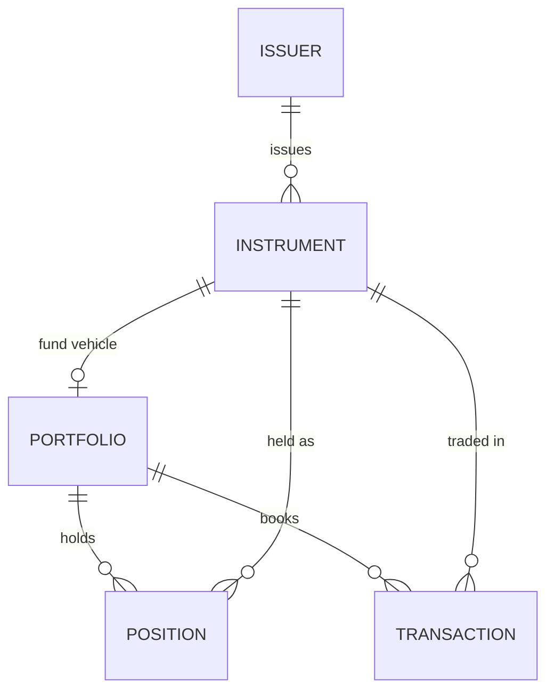

<p align="center">
  <a href="https://quadraplatform.com">
    <picture>
      <source media="(prefers-color-scheme: dark)" srcset="assets/quadra-wordmark-white.svg">
      
    </picture>
  </a>
</p>

# Quadra data model sample

A sample of the [Quadra](https://quadraplatform.com) investment data model — a clean,
**deployable** relational schema for the five entities every investment book turns on:
**portfolios, issuers, instruments, transactions, and positions**, with their supporting
reference data.

Real, load-it-into-Postgres SQL — FIBO-informed and taken directly from a production model.

## What's here

| File | |
|------|--|
| `quadra-sample.postgres.sql` | PostgreSQL DDL — 14 tables across `core` and `ref` schemas |
| `schema/quadra-sample.aml` | Source model in [AML](https://azimutt.app/aml) (Alternative Modeling Language) |
| `schema/quadra-sample.dbml` | [DBML](https://dbml.dbdiagram.io) — paste into [dbdiagram.io](https://dbdiagram.io) for an interactive ERD |

## Entities

**Core (5)** — `portfolio` · `issuer` · `instrument` · `transaction` · `position`

**Reference (9)** — `currency` · `country` · `exchange` · `instrument_type` ·
`portfolio_type` · `investment_strategy` · `transaction_type` · `position_type` · `source`



Reference tables provide the lookups (currencies, countries, exchanges, and the type/source
enumerations) that the core entities key against. Multi-currency throughout — positions and
transactions carry both base and local amounts.

## Try it

```bash
# Load into a PostgreSQL database
psql -d your_db -f quadra-sample.postgres.sql
```

Creates the `core` and `ref` schemas, 14 tables, and their foreign keys. This is a schema
sample — structure and design, not a runnable application or seeded dataset.

## The full data model

This sample is a self-contained slice of the full Quadra data model, which extends it with
parties and custody accounts (transactions link to counterparties, brokers, custodians, and
settlement accounts), master data management, valuations and performance, benchmarks,
corporate actions, and private-markets, real-estate, and infrastructure packs — 180+ tables
in total.

Interested in the full data model, or in the Quadra platform built on top of it?
Get in touch at **[quadraplatform.com](https://quadraplatform.com)**.

## About this repository

This repository is generated automatically from the Quadra production model and updates only
when the corresponding tables change upstream. It is a read-only publication — issues and
pull requests are not accepted.

## License

[MIT](LICENSE)
